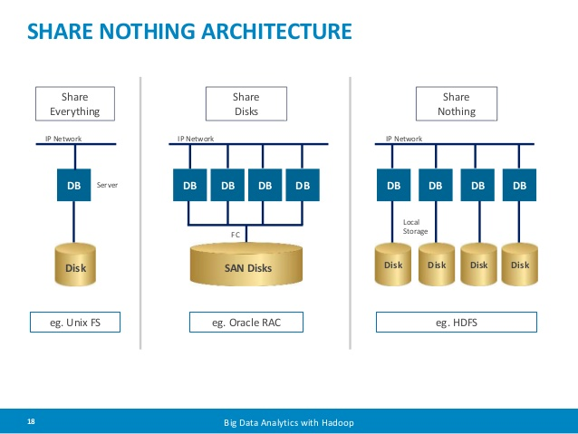

<h1 align="center">
   🚀 Computer Programming Terms
</h1>

    

      <strong id="content"> Content </strong>
    

    
  </sumary>
   
    <ul>
      <li><strong><a href="stateful">Stateful</a></strong></li>
      <li><strong><a href="statefulness">Statefulness</a></strong></li>
      <li><strong><a href="stateless">Stateless</a></strong></li>
      <li><strong><a href="statelessness">Statelessness</a></strong></li>
      <li><strong><a href="shared-nothing">Shared-nothing architecture</a></strong></li>
    </ul>
  

 

<strong><a href="stateful">Stateful</strong>

 

<strong><a href="statefulness">Statefulness</strong>

 

<strong><a href="stateless">Stateless</strong>

 

<strong><a href="statelessness">Statelessness</strong>

 

<strong><a href="shared-nothing">Shared-nothing architecture</strong>

